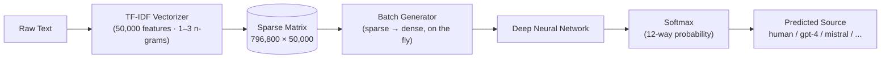
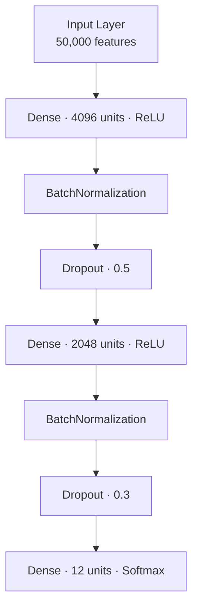

# 🕵️ LLM Text Detective

### Fingerprinting *who* wrote a piece of text — human or one of 11 different language models — using classic TF-IDF features and a deep neural network.


---

## 📖 Table of Contents

- [Overview](#-overview)
- [Why This Matters](#-why-this-matters)
- [The Dataset](#-the-dataset)
- [Pipeline](#-pipeline)
- [Model Architecture](#-model-architecture)
- [Training Setup](#-training-setup)
- [Results](#-results)
- [Tech Stack](#-tech-stack)
- [Getting Started](#-getting-started)
- [Project Structure](#-project-structure)
- [Limitations & Future Work](#-limitations--future-work)
- [Acknowledgements](#-acknowledgements)

---

## 🔍 Overview

Every large language model has a "voice" — subtle statistical habits in word choice, phrasing, and n-gram frequency that differ from a human writer's, and even from *other* LLMs. This project puts that idea to the test.

Given a snippet of text, the model doesn't just answer **"human or AI?"** — it tries to name the *specific* source out of **12 possible authors**:

| # | Source | # | Source |
|---|--------|---|--------|
| 1 | `human` | 7 | `gpt2` |
| 2 | `chatgpt` | 8 | `gpt3` |
| 3 | `cohere` | 9 | `gpt4` |
| 4 | `cohere-chat` | 10 | `mistral` |
| 5 | `llama-chat` | 11 | `mistral-chat` |
| 6 | `mpt` | 12 | `mpt-chat` |

The approach is deliberately "classical": instead of embeddings from a transformer, it leans entirely on **TF-IDF** vectorization feeding a **feed-forward deep neural network** — a test of how far pure lexical statistics can go against a genuinely hard 12-way attribution problem.

> Originally built as an exploration for an *Introduction to AI* course project on LLM text source classification.

---

## 🎯 Why This Matters

As LLM-generated text floods the internet, two related questions keep coming up:

- **Detection** — is this text AI-written at all? (relevant to academic integrity, content moderation, misinformation)
- **Attribution** — if it's AI-written, *which model* wrote it? (relevant to watermark-free model fingerprinting, dataset provenance, and understanding how "distinguishable" different LLM families really are)

This project tackles the harder, more interesting version of the problem: attribution across a crowded field of 11 different models plus humans — not just a binary split.

---

## 🗂️ The Dataset

The data is a large, pre-split corpus of text samples labeled by their source (`generated_by`), stored as Parquet files for fast loading.

| Split | Samples |
|-------|--------:|
| Train | 796,800 |
| Validation | 99,600 |
| Test | 99,600 |
| **Total** | **996,000** |

Each row has just two columns that matter: the raw `text` and its `generated_by` label. Labels are roughly balanced across all 12 classes (~8,200–8,400 samples per class in the test set), which keeps the classification report honest — no class is trivially easy just because it's overrepresented.

---

## ⚙️ Pipeline



The TF-IDF vectorizer captures up to **trigrams** across a **50,000-word vocabulary**, which is large enough to catch distinctive turns of phrase without exploding memory. Because a dense `796,800 × 50,000` matrix would be enormous, the sparse matrix is only densified **one batch at a time**, inside a custom generator — this is what makes training on ~800K rows of 50K-dimensional data feasible on a single GPU.

```python
def data_generator(X, y, batch_size=32):
    while True:
        indices = np.random.permutation(X.shape[0])
        for start in range(0, X.shape[0], batch_size):
            batch_idx = indices[start:start + batch_size]
            yield X[batch_idx].toarray(), y[batch_idx]
```

---

## 🧠 Model Architecture



| Layer | Units | Activation | Regularization |
|-------|------:|------------|-----------------|
| Input | 50,000 | — | — |
| Dense 1 | 4,096 | ReLU | BatchNorm + Dropout(0.5) |
| Dense 2 | 2,048 | ReLU | BatchNorm + Dropout(0.3) |
| Output | 12 | Softmax | — |

Two aggressively wide dense layers, heavily regularized with batch normalization and steep dropout, are what keep a network this large from simply memorizing 800K sparse TF-IDF vectors.

---

## 🏋️ Training Setup

| Hyperparameter | Value |
|---|---|
| Optimizer | Adam (`lr = 0.0001`) |
| Loss | Sparse Categorical Crossentropy |
| Batch size | 32 |
| Epochs | 25 |
| Early stopping | Monitors `val_accuracy`, restores best weights |
| Data feed | Custom generator (sparse → dense per batch) |

---

## 📊 Results

### Learning curve

| Epoch | Train Acc | Train Loss | Val Acc | Val Loss |
|------:|----------:|-----------:|--------:|---------:|
| 1 | 62.38% | 1.1221 | 74.42% | 0.7249 |
| 5 | 89.70% | 0.2951 | 80.30% | 0.6655 |
| 10 | 90.94% | 0.2571 | 80.91% | 0.7132 |
| 15 | 91.26% | 0.2456 | 80.95% | 0.7286 |
| 20 | 91.41% | 0.2402 | 81.07% | 0.7285 |
| 25 | 91.56% | 0.2358 | 81.09% | 0.7476 |

The model converges fast — most of the learning happens in the first 5 epochs — and then spends the remaining 20 epochs squeezing out marginal validation gains while training accuracy keeps climbing. That widening gap (91.6% train vs ~81% val) is the model's clearest tell that it's pushing into overfitting territory by the end.

### Final scores

| Metric | Score |
|---|---|
| **Validation Accuracy** | **81.19%** |
| **Test Accuracy** | **81.19%** |
| Macro F1 | 0.82 |
| Weighted F1 | 0.82 |

### Per-class F1 score

```
chatgpt        ████████████████████████████▓   0.89
gpt4           ████████████████████████████▓   0.90
llama-chat     ████████████████████████████▓   0.88
human          ███████████████████████████▓    0.87
gpt3           ███████████████████████████▓    0.86
cohere-chat    ██████████████████████████▓     0.83
cohere         ██████████████████████████      0.82
mistral-chat   ██████████████████████████      0.82
gpt2           █████████████████████████▓      0.81
mpt            █████████████████████████       0.80
mistral        ████████████████████████        0.76
mpt-chat       ███████████████████             0.60
```

Almost every class sits comfortably in the 0.76–0.90 F1 range — **except `mpt-chat`**, which stands out as the model's weak point: **46% precision but 86% recall**. In plain terms, the model calls "mpt-chat!" far too often, using it as a kind of catch-all bucket whenever it's unsure — dragging recall up but precision way down. If there's one place to focus improvement efforts, it's untangling `mpt-chat` from its neighbors.

---

## 🛠️ Tech Stack

| Purpose | Library |
|---|---|
| Data handling | `pandas`, `numpy` |
| Feature extraction | `scikit-learn` (`TfidfVectorizer`, `LabelEncoder`) |
| Modeling | `TensorFlow` / `Keras` (`Sequential`, `Dense`, `Dropout`, `BatchNormalization`) |
| Evaluation | `scikit-learn` (`classification_report`, `confusion_matrix`) |
| Visualization | `matplotlib`, `seaborn` |
| Misc | `joblib`, `gc` |

---

## 📁 Project Structure

```
.
├── tfidf-dnn.ipynb     # Main notebook: pipeline, training, evaluation, demo
└── README.md           # You are here
```

---

## 🔮 Limitations & Future Work

- **Overfitting gap** — ~10-point spread between train and validation accuracy suggests the model would benefit from stronger regularization, more dropout, or simply more diverse training data.
- **`mpt-chat` confusion** — the weakest class by a wide margin; worth a dedicated error analysis (confusion matrix inspection) to see exactly which classes it's absorbing.
- **Lexical ceiling** — TF-IDF captures *word choice*, not *meaning*. A natural next step is comparing this against transformer-based embeddings (e.g., a fine-tuned BERT/RoBERTa) to see how much headroom is left once semantics enter the picture.
- **Feature size trade-off** — 50,000 features with trigrams is a large, memory-hungry vocabulary; a systematic sweep over `max_features` and n-gram range could reveal a cheaper sweet spot.

---

## 🙏 Acknowledgements

Built as part of coursework exploring how far classical NLP techniques can go at the increasingly relevant task of telling human and machine-generated text apart — and telling different machines apart from each other.
